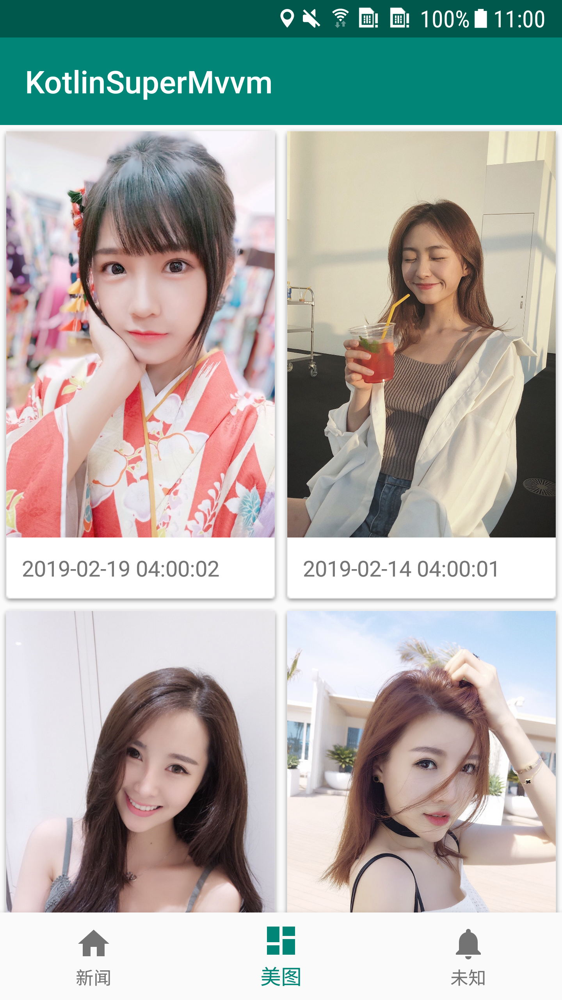

# KotlinSuperMvvm
🔥基于Kotlin+MVVM+LiveData+协程的新闻美图应用
## **简介**
一款使用Kotlin语言的，遵循**Material Design**风格的新闻，美图应用
- Android一些次新的技术的一个合集示例
- 使用AndroidX库
- API来自网络免费API（感谢提供api的服务商）
- MVVM+LiveData模式
- Retrofit2（+Coroutine）网络请求，使用retrofit-url-manager处理baseURL的切换问题
- Glide加载缓存图片（瀑布流卡片显示）
- 使用RecyclerView展示列表

#### V0.3
- 加入下拉刷新和上拉加载更多

#### V0.2
- 整体框架搭建完毕，美图接口正常请求，可以显示内容

## **截图**
#### 美图

